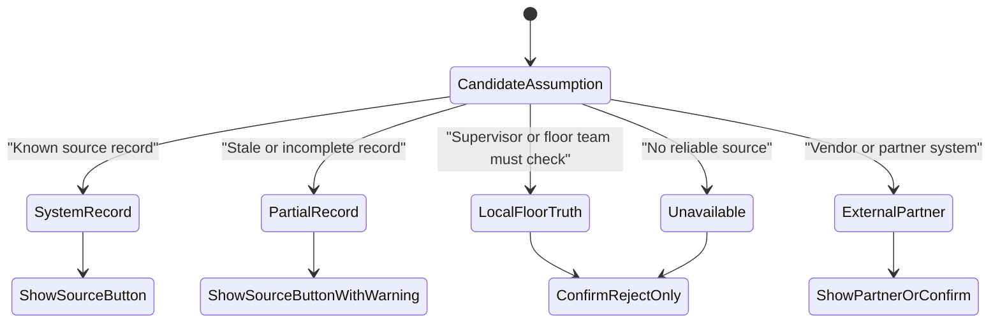
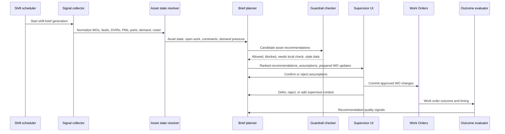
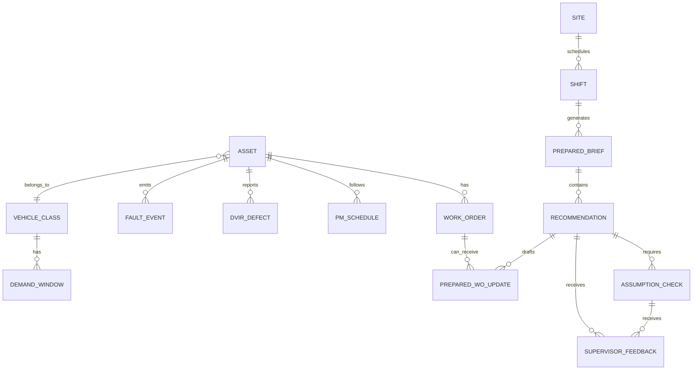
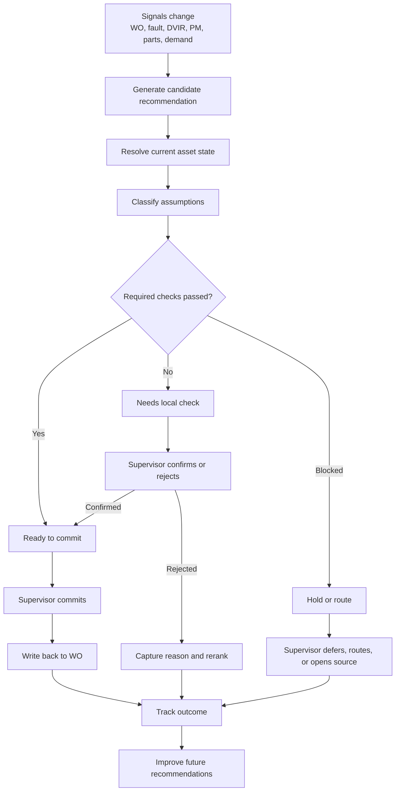
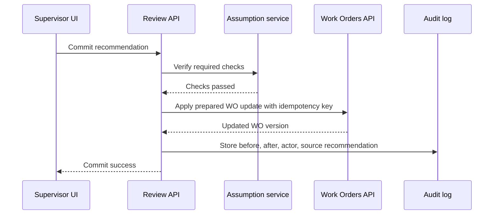

# Prepared Asset Brief Backend and Agentic Architecture

Status: `[AI-DRAFT]` system design for James review.  
Date: 2026-06-17

## Purpose

`[JAMES]` The product should not feel like an AI page. Work Orders stay the parent surface. The Prepared Asset Plan is a review layer that helps the supervisor decide what to start, hold, close, bundle, or route before the shift gets away from them.

`[AI-INFERENCE]` The backend should therefore do three jobs:

1. Keep Work Orders as the system of record.
2. Generate a ranked asset-level brief with supporting assumptions and prepared WO updates.
3. Capture the supervisor's confirmations, rejections, commits, and deferrals so the system gets better over time.

In the current prototype, this is represented as:

- Parent surface: `Connected Maintenance > Work Orders`.
- Review surface: `Prepared Asset Plan`.
- Backend name in this note: `Prepared Asset Brief`.

## Core Principle

`[JAMES]` Do not show a source button when the data does not live in Samsara or likely anywhere else.

`[AI-INFERENCE]` The backend needs a first-class concept of sourceability. Every recommendation can include assumptions, but not every assumption has a system record behind it.

Examples:

| Assumption | Sourceability | UI behavior |
|---|---|---|
| Brake pads are staged | `system_record` | Show `Parts` source plus Confirm / Reject |
| Tech 7 and Tech 19 are on shift | `system_record` | Show `Schedule` source plus Confirm / Reject |
| Bay 04 is physically open | `local_floor_truth` | Confirm / Reject only |
| Vehicle is blocked behind return-lane cars | `local_floor_truth` | Confirm / Reject only |
| Dealer ETA is current | `external_partner` | Partner/source link if integrated, otherwise Confirm / Reject |

## System Context

`[AI-INFERENCE]` The Prepared Asset Brief sits between operational data and the supervisor's Work Orders workflow. It does not replace the CMMS, scheduling board, inventory system, or local judgment.

```mermaid
flowchart LR
  subgraph Sources["Operational sources"]
    Maintenance["Samsara maintenance data<br/>WOs, faults, DVIRs, PMs"]
    Parts["Parts and procurement<br/>inventory, POs, reservations"]
    Vendors["Warranty and vendors<br/>coverage, dealer path, ETA"]
    Rental["Rental operations<br/>class demand, ready line, holds"]
    Local["Local shop context<br/>roster, bays, handoff notes"]
  end

  Sources --> Ingest["Ingestion and normalization"]
  Ingest --> StateStore[("Operational state store")]
  StateStore --> BriefService["Prepared Asset Brief service"]
  BriefService --> ReviewApi["Review API"]
  ReviewApi --> WorkOrdersUi["Connected Maintenance > Work Orders"]
  WorkOrdersUi --> Feedback["Confirm, reject, defer, commit"]
  Feedback --> AuditStore[("Audit and learning store")]
  Feedback --> Writeback["WO writeback service"]
  Writeback --> WorkOrders[("Work Orders system of record")]
```

## Backend Responsibilities

| Responsibility | What it does | Prototype equivalent |
|---|---|---|
| Work Orders index | Returns the ordinary Work Orders table, filters, summary counts, and subtle Prepared plan badges | `GET /api/work-orders` |
| Brief generation | Builds the ranked asset-level plan for a shift | `GET /api/shift-brief/current` currently hydrates seeded recommendations |
| Recommendation detail | Returns one plan decision with impacted WOs, assumptions, and prepared updates | `GET /api/focus-items/:id` plus hydrated `workOrderQueue` data |
| Assumption review | Captures Confirm / Reject and rejection context | Prototype feedback and local context routes |
| Source drill-in | Opens a real source only when sourceability allows it | Current UI derives source buttons from check labels |
| WO writeback | Applies approved updates to WOs after supervisor action | Mocked as UI actions today |
| Feedback and outcomes | Stores what was accepted, rejected, deferred, and whether the action helped | `supervisor_feedback`, `local_context_captures`, metrics route |

## Deterministic vs Agentic Work

`[AI-INFERENCE]` A credible architecture should not make the LLM responsible for everything. The important split is:

| Layer | Better handled by deterministic logic | Better handled by agentic/LLM logic |
|---|---|---|
| Safety and compliance | Recall present, unsafe DVIR, open safety defect, warranty rule | Summarizing why a safety item matters to this shift |
| Sourceability | Whether a source exists, whether it is stale, whether a link can be shown | Explaining what local check is needed in plain language |
| Feasibility | Part count, PO status, tech on shift, open WO status | Reconciling messy notes, invoice text, return comments, or handoff notes |
| Ranking | Hard constraints, class shortage thresholds, stale ETA windows | Synthesizing tradeoffs when multiple weak signals point in the same direction |
| Writeback | Idempotent API update, audit trail, permissions | Drafting the proposed WO amendment text |

Guardrail: an agent can prepare a recommendation, but it should not silently mutate a Work Order. The supervisor commits the change.

## Agentic Loop

`[AI-DRAFT]` A production system could be implemented as one service with modular steps, not necessarily as many independent agents. The important design is the loop.

## Logical Components

### 1. Ingestion and Normalization

`[AI-INFERENCE]` Pulls source data into a normalized operational model.

Inputs:

- Work Orders, assets, faults, DVIRs, PM schedules.
- Inventory, part reservations, purchase orders.
- Warranty coverage, vendor jobs, dealer ETA.
- Vehicle class demand, ready-line counts, rental holds.
- Technician schedule, skills, handoff notes.
- Optional local captures from the floor.

Outputs:

- Clean asset records.
- Open WO records.
- Source events with timestamps and confidence.
- Linkable source references only where a real source exists.

### 2. Asset State Resolver

`[AI-INFERENCE]` Builds the current state of each vehicle.

For each asset:

- Current location and availability state.
- Open WOs and draft WOs.
- Safety, recall, warranty, and vendor flags.
- Parts readiness.
- Tech and bay feasibility where known.
- Rental-class impact.

The resolver should explicitly mark unknowns. Unknown bay occupancy is not the same as "bay available."

### 3. Candidate Generator

`[AI-INFERENCE]` Creates possible recommendations.

Examples:

- Start this vehicle now because the class is short and work is ready.
- Hold this WO because the required part is not confirmed.
- Close this WO because the DVIR appears resolved.
- Bundle this PM while the vehicle is already in the bay.
- Route this repair through warranty or vendor path.
- Deprioritize low-impact work during a demand surge.

### 4. Feasibility and Guardrail Checker

`[AI-INFERENCE]` Blocks recommendations that would be unsafe, unsupported, or misleading.

Guardrails:

- Do not release a vehicle with unresolved safety defects.
- Do not assign labor to work blocked by unavailable parts.
- Do not claim bay availability unless a source exists or a supervisor confirms it.
- Do not show a source link for local-only floor truth.
- Do not write back to a WO without supervisor approval.
- Do not hide low confidence; route it to a check.

### 5. Ranking Engine

`[AI-INFERENCE]` Stack-ranks vehicle recommendations by operational value and feasibility.

Inputs:

- Rental class shortage or upcoming demand peak.
- Vehicle return-to-ready value.
- Estimated work time.
- Parts readiness.
- Tech availability.
- Safety/warranty/vendor constraints.
- Repeat shop-visit avoidance.
- Confidence and required local checks.

Output:

- Ranked recommendations such as "12 vehicle recommendations prepared for day shift."
- Horizon labels: `This shift`, `Next 24-48h`, `Weekend surge`.
- State labels: `Ready to commit`, `Needs local check`, `Blocked`, `Vendor path`.

### 6. Assumption Classifier

`[AI-INFERENCE]` Converts hidden uncertainty into explicit checks.

Each check should have:

- `label`
- `status`: `needs_check`, `confirmed`, `rejected`, `stale`
- `sourceability`: `system_record`, `partial_system_record`, `local_floor_truth`, `external_partner`, `unavailable`
- `sourceRef`: nullable
- `requiredBeforeCommit`: boolean
- `rejectionReason`: nullable

This is the backend contract that prevents fake source buttons.

### 7. Prepared WO Update Service

`[AI-INFERENCE]` Drafts the change, but does not commit it.

Prepared update types:

- Assign technician.
- Close WO.
- Add bundled PM scope.
- Hold until part confirmed.
- Route to vendor or warranty.
- Create draft WO.
- Deprioritize or release from the plan.

Each update needs:

- Current WO snapshot.
- Proposed change.
- Impact.
- Tradeoff.
- Guardrail.
- Required checks.
- Idempotency key.

### 8. Review API and Work Orders UI

`[AI-INFERENCE]` Serves the normal Work Orders tab and the review layer.

The parent Work Orders page should use operational language:

- `Prepared plan`
- `Review plan`
- `Needs local check`
- `Ready to commit`
- `WOs affected`

It should not explain AI logic.

### 9. Feedback and Outcome Logger

`[AI-INFERENCE]` Records how the supervisor responded and what happened afterward.

Events:

- Assumption confirmed.
- Assumption rejected.
- Recommendation committed.
- Recommendation deferred.
- WO update applied.
- WO reopened.
- Vehicle returned to ready line.
- Vehicle still blocked after commit.
- Supervisor added local context.

This is how the system learns whether it is making useful recommendations.

## Data Model

Prototype objects map cleanly to production objects, but production would likely split them across services.

Core production tables or service objects:

| Object | Purpose |
|---|---|
| `asset` | Vehicle identity, class, status, location, history |
| `work_order` | Existing maintenance execution record |
| `source_event` | Fault, DVIR, PM, return inspection, note, invoice, vendor update |
| `inventory_state` | Part counts, reservations, PO status |
| `technician_shift` | Tech availability and skills |
| `local_context` | Supervisor or floor-team captures |
| `prepared_brief` | One generated brief for a site and shift |
| `recommendation` | One ranked asset-level decision |
| `assumption_check` | Human-verifiable condition before commit |
| `prepared_wo_update` | Draft mutation to one or more WOs |
| `supervisor_feedback` | Confirm, reject, defer, commit, reason |
| `outcome_event` | What happened after the recommendation |

## API Contract

Current prototype endpoints:

| Endpoint | Role |
|---|---|
| `GET /api/work-orders` | Parent Work Orders table, filters, summary, Prepared plan badges |
| `GET /api/shift-brief/current` | Current brief, ranked recommendations, operation scale |
| `GET /api/focus-items/:id` | Focus item detail |
| `POST /api/focus-items/:id/feedback` | Store supervisor action |
| `POST /api/focus-items/:id/local-context` | Store local context capture |
| `GET /api/assets/:id` | Asset detail |
| `GET /api/work-orders/:id` | WO detail |
| `GET /api/metrics/shift-brief/:id` | Mock metrics and feedback summary |

Recommended production endpoints:

| Endpoint | Role |
|---|---|
| `GET /api/work-orders?siteId=&status=&source=&class=&sort=` | Parent Work Orders index |
| `GET /api/prepared-asset-brief/current?siteId=&shiftId=` | Current prepared brief |
| `POST /api/prepared-asset-brief/generate` | Generate or regenerate a brief |
| `GET /api/prepared-asset-brief/:briefId/recommendations/:id` | One recommendation with assumptions and WO updates |
| `POST /api/recommendations/:id/assumptions/:checkId/confirm` | Confirm one check |
| `POST /api/recommendations/:id/assumptions/:checkId/reject` | Reject one check and capture context |
| `POST /api/recommendations/:id/commit` | Apply approved WO update |
| `POST /api/recommendations/:id/defer` | Defer recommendation |
| `GET /api/sources/:sourceType/:sourceId` | Open source detail only when a real source exists |
| `GET /api/prepared-asset-brief/:briefId/outcomes` | Evaluation and metrics |

## Recommendation Lifecycle

## Event Design

`[AI-INFERENCE]` The brief should be event-driven enough to stay current, but not so reactive that it churns while a supervisor is reviewing it.

Key events:

| Event | Producer | Consumer |
|---|---|---|
| `work_order.created` | Work Orders | Asset state resolver |
| `work_order.updated` | Work Orders | Brief service, outcome evaluator |
| `fault.detected` | Telematics | Candidate generator |
| `dvir.defect_reported` | DVIR flow | Candidate generator |
| `part.inventory_changed` | Inventory | Feasibility checker |
| `purchase_order.updated` | Procurement | Feasibility checker |
| `vendor_job.updated` | Vendor integration | Candidate generator |
| `shift.started` | Scheduler | Brief generator |
| `assumption.confirmed` | Supervisor UI | Recommendation state machine |
| `assumption.rejected` | Supervisor UI | Reranker, learning store |
| `recommendation.committed` | Supervisor UI | Writeback service |
| `vehicle.ready_line_returned` | Operations | Outcome evaluator |

Design choice:

- Generate a stable shift-start brief.
- Refresh individual recommendations when critical source events change.
- Show stale-data warnings instead of silently changing the plan under the supervisor.

## Writeback Safety

`[AI-INFERENCE]` Writeback is the riskiest backend surface. It needs boring controls.

Requirements:

- Human approval before mutation.
- Idempotency key per prepared update.
- Permission check against the supervisor role.
- Current WO version check before commit.
- Audit log with before and after state.
- Rollback or follow-up task if writeback fails.
- Clear failure state in the UI.

Commit flow:

## Metrics the Backend Should Emit

`[AI-INFERENCE]` These are measurable because they tie to explicit events.

| Metric | How to measure |
|---|---|
| Prepared recommendation yield | `committed_recommendations / surfaced_recommendations` |
| Ready-to-commit accuracy | `committed_ready_recommendations that did not immediately block / committed_ready_recommendations` |
| Local check rejection rate | `rejected_assumption_checks / reviewed_assumption_checks` |
| False-ready-to-start rate | WOs assigned from brief that later stalled on parts, bay, access, or staffing |
| Time to first useful action | Time from brief open to first commit, defer, or valid rejection |
| Uptime recovered proxy | Vehicles returned to rentable status from committed recommendations, weighted by class demand pressure |
| Bundle value realized | Avoided repeat shop visits or avoided second hold compared with baseline PM timing |
| Source coverage | Recommendations with enough system evidence to avoid local checks |

## V1 Boundary

`[AI-DRAFT]` A realistic V1 should not try to own the whole planning stack.

V1 should include:

- Parent Work Orders tab entry point.
- Prepared Asset Brief generation for one site and shift.
- Ranked asset recommendations.
- Impacted WOs underneath each asset.
- Assumptions to verify.
- Sourceability contract.
- Prepared WO updates.
- Supervisor Confirm / Reject / Defer / Commit events.
- Audit trail and basic outcome metrics.

V1 should not include:

- Full scheduling optimization.
- Autonomous WO mutation.
- Full bay occupancy truth unless a customer already has that data.
- Full procurement automation.
- Full vendor network integration.
- A chatbot as the primary surface.

## Later Expansion

`[AI-INFERENCE]` The product can compound as Samsara connects more context:

- Partner APIs for parts availability and ETA.
- Vendor and dealer repair status.
- Better bay and lane occupancy data if the customer has sensors or workflows.
- Photo and voice capture from floor checks.
- Warranty claim preparation.
- Automated bundle proposals with stronger ROI evidence.
- Multi-shift handoff and weekend demand planning.
- Cross-site benchmarking.

## Open Design Questions

1. `[AI-DRAFT]` Should "Prepared Asset Brief" be the backend/service name while "Prepared Asset Plan" remains the UI label?
2. `[AI-DRAFT]` Which local checks are worth capturing as structured data after rejection or confirmation?
3. `[AI-DRAFT]` What confidence threshold should move a recommendation from "Ready to commit" to "Needs local check"?
4. `[AI-DRAFT]` Should sourceability be inferred by the system, configured by implementation, or both?
5. `[AI-DRAFT]` What is the smallest writeback action that demonstrates value without creating operational risk?

