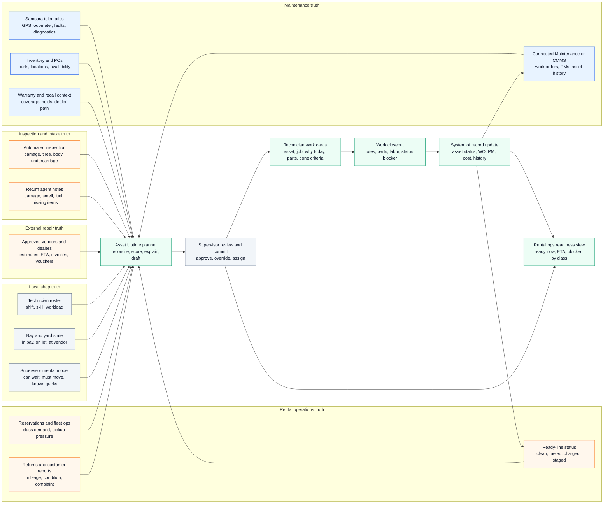

# Hertz LAX Systems And Data Flow

Date: 2026-06-14
Status: systems/workflow mapping for James review. Stops before metrics.
Purpose: map the Hertz LAX day-in-life to existing tools, systems, data objects, gaps, and feasibility.

## Decision Context

`[JAMES]` Hertz LAX is now the representative customer and landmark.

`[SOURCE]` The assignment centers a maintenance supervisor starting the morning shift and asking what the team should work on today.

`[SOURCE]` Samsara's current Connected Maintenance page already claims many system objects: assets, asset status, DVIRs, fault codes, work orders, PM schedules, parts inventory, POs, vendors, invoices, warranty, maintenance costs, asset history, and integrations.

`[AI-INFERENCE]` The gap is not raw maintenance data. The gap is the operating layer that reconciles maintenance truth, rental-operations truth, and local shop truth into a plan the supervisor can commit.

## Executive Read

`[AI-INFERENCE]` At Hertz LAX, the maintenance supervisor is not just managing repairs. They are managing the conversion of returned or held vehicles back into rentable inventory.

`[AI-INFERENCE]` Existing systems likely know many useful facts, but they do not naturally answer the supervisor's real morning question: "Which vehicles can we move back to revenue today, what is blocking the rest, and what can my team actually execute?"

`[AI-INFERENCE]` The product is feasible if v1 is framed as a reviewable planning layer, not an autonomous repair dispatcher. It can start by reconciling data, exposing gaps, and preparing work packages. It should not initially depend on perfect vendor APIs, perfect inventory hygiene, or fully automated assignment.

`[JAMES]` "Revenue-readiness" feels too Hertz-specific as the top-level frame. The generalizable product frame is Asset Uptime.

`[AI-INFERENCE]` Asset Uptime is the durable Samsara frame. At Hertz LAX, the local expression of asset uptime is "can this vehicle return to rentable inventory?"

## The Three Truths That Need To Be Joined

### 1. Maintenance Truth

What is broken, due, open, diagnosed, blocked, or complete.

Likely data:

- Work orders.
- PM schedules.
- Fault codes.
- Odometer and usage.
- Asset history.
- Parts and inventory.
- Warranty and recall state.
- Vendor work and invoices.
- Technician notes and closeout.

Likely systems:

- Samsara Connected Maintenance.
- Existing CMMS tools such as Fleetio, MaintainX, Fullbay, AssetWorks, Trimble, or internal systems.
- Vendor/dealer systems.

### 2. Rental-Operations Truth

Which cars are actually needed, available, rentable, rentable soon, or unavailable to customers.

Likely data:

- Reservations by vehicle class.
- Ready-line inventory.
- Return volume.
- Customer wait pressure.
- Vehicle class shortages.
- Clean/fuel/charge state.
- Vehicle location in the rental center.
- Holds from damage, recalls, cleaning, charging, or maintenance.

Likely systems:

- Hertz rental/reservation/fleet operations systems.
- Ready-line or lot-management tools.
- Return/check-in tools.
- Automated inspection systems.

### 3. Local Shop Truth

What the supervisor, technicians, and lot team know that may not be cleanly captured anywhere.

Likely data:

- Who is actually on shift.
- Technician skill and speed.
- Bay and lift availability.
- Which car is physically accessible.
- Which part is informally reserved.
- Which vendor is reliable today.
- Which issue can safely wait.
- Which job is a trap because history is missing.

Likely systems:

- Whiteboard.
- Supervisor memory.
- Team huddle.
- Texts, calls, radio, notes.
- Technician mobile app if adopted.

`[AI-INFERENCE]` The product opportunity lives where these truths disagree.

## Visible System And Data Flow

Legend:

- Blue: likely already in Samsara or maintenance systems.
- Orange: valuable but likely external, messy, or integration-dependent.
- Gray: human/local context.
- Green: proposed planning layer and outputs.

## Predictive Loop And Where It Breaks Now

`[JAMES]` For any predictive tool, we need to think about the input data, the output data, and the full loop, not just the linear path of data.

`[AI-INFERENCE]` This is the key product trap. A prediction is not valuable until it changes an action and the system learns whether that action improved asset uptime.

### The Loop

1. Sense: collect signals from telematics, PMs, WOs, returns, inspections, parts, vendors, technician roster, ready-line state, and rental demand.
2. Predict: estimate risk, priority, readiness, downtime, return-to-service time, and asset-uptime impact.
3. Recommend: produce a ranked plan, blocked reasons, assignments, deferrals, and ops-facing availability forecast.
4. Commit: supervisor reviews, edits, approves, overrides, and takes accountability for the plan.
5. Execute: technicians, parts owners, vendors, and rental operations act on the plan.
6. Observe outcome: capture completion, blockers, time, parts used, new findings, asset status, ready-line status, and whether the asset actually returned to service.
7. Learn and adjust: update future estimates, confidence, routing rules, blocked reasons, and plan recommendations.

### Where The Loop Breaks

| Breakpoint | What Breaks | Why It Matters | Product Implication |
|---|---|---|---|
| Identity join | The same vehicle, WO, return record, vendor estimate, and ready-line status do not resolve cleanly to one asset state. | The planner cannot know whether an asset is ready, blocked, duplicated, or stale. | V1 needs a visible asset-state reconciliation layer and conflict flags. |
| Signal quality | Faults, customer complaints, inspection notes, and automated scans can be noisy, vague, duplicated, or low confidence. | Prediction can create false urgency or miss the real issue. | Show source, confidence, severity, evidence, and "needs review" states. |
| Missing local context | Technician skill, bay state, physical vehicle location, informal parts reservation, and "can wait" judgment stay in heads or on whiteboards. | The model can recommend work that cannot actually start. | Capture only the minimum local context needed for readiness. Do not digitize the whole shop at once. |
| Output actionability | A ranked list says what matters but not who should do it, what is needed, why today, or what done means. | The supervisor still has to translate prediction into work. | Output should be a committed plan and technician-ready work cards, not just risk scores. |
| Human trust | The supervisor cannot inspect reasoning, tradeoffs, or uncertainty. | They ignore the recommendation or recreate the plan manually. | Require supervisor review/commit. Make overrides easy and capture the reason. |
| Execution drift | A part is missing, a tech finds extra work, a vendor delays, or operations changes demand. | The original plan becomes stale quickly. | Treat the plan as a living loop with blocker updates and plan-impact alerts. |
| Closeout quality | Technicians or vendors close work with sparse notes, missing parts, missing time, or unclear asset status. | The system cannot learn which recommendations were right. | Closeout must capture outcome labels: done, blocked, deferred, returned to service, not returned, reason. |
| Ops feedback | Maintenance marks work done but rental operations still sees the asset as unavailable, unclean, uncharged, or not staged. | Asset uptime is not achieved until the asset is usable. | The loop must end in an availability state, not just WO completion. |
| Learning target | The model optimizes for closing work orders instead of improving asset uptime. | The product can look productive while not improving the business outcome. | Train and measure against asset uptime outcomes: ready, available, downtime avoided, forecast accuracy. |

`[AI-INFERENCE]` The most important break is the output and feedback loop. Existing tools can ingest many signals. The harder job is making the prediction executable, observing what happened, and feeding that back into the next plan.

## Existing Tools And Data Objects

| System or tool | What it likely owns | Evidence basis | Gap for the planner |
|---|---|---|---|
| Samsara telematics / IoT | GPS, odometer, diagnostics, faults, usage, possibly EV state. | `[SOURCE]` Samsara prompt and product page describe real-time vehicle/equipment data, fault codes, diagnostics, usage, GPS, meter data. | Strong input, but faults and diagnostics do not equal a daily shop plan. |
| Samsara Connected Maintenance / CMMS | Work orders, PM schedules, asset history, costs, inventory, vendors, invoices, warranty, POs. | `[SOURCE]` Samsara page claims these objects. Competitor sources show this is table stakes. | Strong input, but generic work-order status does not answer whether work is ready, valuable today, or aligned to rental demand. |
| Hertz rental operations / reservation systems | Vehicle class demand, reservations, customer wait pressure, fleet availability, swaps. | `[SOURCE]` Hertz public reporting emphasizes utilization, RPU, RPD, fleet planning, transaction days. | Critical for Hertz. Likely not naturally inside a CMMS. Needs integration or mocked input in prototype. |
| Ready-line / lot operations | Clean/fueled/charged/staged state, physical vehicle location, ready count by class. | `[SOURCE]` LAWA says LAX Rental Car Center streamlines fueling, washing, and light maintenance to speed availability. | "On site" is not the same as "rentable." This may be split across ops tools and local knowledge. |
| Return inspection and damage capture | Return condition, customer issue, mileage, fuel/charge, damage, photos, automated scan findings. | `[SOURCE]` Hertz/UVeye source shows automated inspection for body, glass, tires, and undercarriage. | Signal quality varies. Complaints and inspection findings need normalization before becoming work. |
| Parts / inventory / procurement | On-hand quantity, location, consumption, POs, low-stock and out-of-stock status. | `[SOURCE]` Samsara claims inventory and PO management. Fleetio/MaintainX/Fullbay also compete here. | Inventory data can be stale. The planner needs confidence and whether a part is reserved for this job. |
| Vendor / dealer / approved repair path | Approved repair location, work order or voucher, estimate, ETA, invoice, authorization changes. | `[SOURCE]` Hertz maintenance support pages describe service-center work orders, vouchers, approval, and approved repair locations. | Real-time vendor ETA and estimate status may be weak unless integrated. Start with manual status or uploaded docs. |
| Technician execution app / paper / whiteboard | Assignment, job instructions, status, notes, photos, time, blockers. | `[SOURCE]` Samsara and competitors all claim technician execution features; Sean context flagged low-friction technician capture. | Clean handoff is mandatory. If this creates technician admin, the plan will decay. |
| Supervisor whiteboard and memory | Priority, informal constraints, team skill, bay reality, "can wait" judgment. | `[SOURCE]` The prompt says planning still happens on whiteboards and in heads. | This is the hardest data source. V1 should capture only the minimum local context needed to make a plan. |
| Fleet asset management / finance | Utilization, depreciation, fleet age, de-fleet timing, repair-versus-retire judgment. | `[SOURCE]` Hertz Q1 2026 reporting centers utilization, depreciation per unit, revenue per unit, direct operating expense. | Important for strategic decisions, but likely too broad for first workflow. Use as context, not v1 core. |

## Day-In-Life Mapped To Systems

### 4:45 AM To 5:30 AM - Pre-Shift Scan

Supervisor question:

`[AI-INFERENCE]` "What changed overnight, and what can we return to revenue today?"

Inputs:

- Overnight returns.
- Open work orders.
- Overdue and upcoming PMs.
- Active faults.
- Damage and recall holds.
- Ready-line count by class.
- Reservations by class.
- Vehicles at vendor or dealer.
- Parts that arrived or failed to arrive.
- Technician roster.

Current systems:

- Samsara/CMMS for WOs, PMs, faults, asset history.
- Rental operations system for reservations and class demand.
- Ready-line/lot system for rentable inventory.
- Vendor/dealer updates for external work.
- Whiteboard or memory for local constraints.

Gap:

`[AI-INFERENCE]` These inputs describe the same vehicles from different angles, but no single system naturally says: "Here are the ten vehicles most worth moving today, and here is why."

Feasibility:

High for a prototype. Medium for production until reservation, ready-line, and local-shop context are integrated or lightly captured.

### 5:30 AM To 6:20 AM - Plan And Huddle

Supervisor question:

`[AI-INFERENCE]` "What work should each tech start, and what should operations believe about availability?"

Inputs:

- Technician shift, skill, and workload.
- Bay and lift availability.
- Job duration estimate.
- Parts and tools availability.
- Vehicle class urgency.
- Safety, recall, warranty, or vendor path.

Current systems:

- CMMS/work-order system for job details.
- Technician app or paper for assignment.
- Inventory system for parts.
- Supervisor memory for skill and sequence.

Gap:

`[AI-INFERENCE]` A priority queue is not enough. The plan needs readiness, sequence, and a reason. It must produce both technician work and an ops-facing promise.

Feasibility:

High if v1 uses a supervisor review/commit surface and lightweight tech roster. Lower if it tries to fully optimize labor scheduling.

### 6:20 AM To 10:00 AM - First Execution Wave

Supervisor question:

`[AI-INFERENCE]` "Is the plan still true now that work has started?"

Inputs:

- Technician status.
- Found conditions.
- Missing parts.
- New damage or customer complaints.
- Vendor delays.
- New returns.
- Reservation pressure.

Current systems:

- Technician mobile app or paper closeout.
- CMMS status.
- Return/check-in tools.
- Vendor communication.
- Rental operations asks and escalations.

Gap:

`[AI-INFERENCE]` The moment a technician finds extra work or a part is missing, the plan can become stale. The system needs a plan-change loop, not just static assignments.

Feasibility:

Medium-high if updates are simple: "blocked," "needs approval," "done," "found extra issue," "ETA changed." Low if v1 requires full technician workflow replacement.

### 10:00 AM To 1:00 PM - Revenue-Readiness Checkpoint

Supervisor question:

`[AI-INFERENCE]` "What can still make it back to the ready line today?"

Inputs:

- Completed work.
- Remaining job durations.
- Vehicles needed by class.
- Vendor ETAs.
- Parts arrivals.
- Updated holds.

Current systems:

- CMMS and technician status.
- Rental ops / ready-line inventory.
- Vendor updates.
- Parts/PO status.

Gap:

`[AI-INFERENCE]` Standard maintenance tools show status, but the supervisor needs a forecast by revenue impact: ready now, ready soon, unlikely today, blocked.

Feasibility:

Medium. Forecasting can start with rough ETAs and confidence, then improve with historical job duration and vendor turnaround data.

### 1:00 PM To 4:00 PM - Afternoon Pressure

Supervisor question:

`[AI-INFERENCE]` "What changes because demand, returns, or diagnosis changed?"

Inputs:

- New returns and damage.
- Flight and pickup pressure.
- New faults or customer complaints.
- Recalls or non-rentable holds.
- Late vendor calls.
- Work-order closeouts.

Current systems:

- Rental ops tools.
- Return inspection tools.
- CMMS.
- Vendor communication.
- Whiteboard or huddle.

Gap:

`[AI-INFERENCE]` Replanning is usually where a human supervisor earns trust. The product should not hide tradeoffs. It should show why a new job displaces something else.

Feasibility:

Medium. Start with "plan impact" alerts instead of full automatic rescheduling.

### 4:00 PM To 5:30 PM - Shift Handoff

Supervisor question:

`[AI-INFERENCE]` "What must the next shift know so the same work does not get rediscovered tomorrow?"

Inputs:

- Completed jobs.
- Open blockers.
- Carryover work.
- Vehicles awaiting vendor, parts, cleaning, fuel, charge, or approval.
- Ops promises already made.

Current systems:

- CMMS/work orders.
- Technician notes.
- Ready-line/ops status.
- Whiteboard.
- Vendor/parts updates.

Gap:

`[AI-INFERENCE]` Closeout and carryover are where structured data often falls apart. If blockers and next actions are not clear, tomorrow's plan starts with archaeology.

Feasibility:

High for simple carryover capture. Medium if it must reconcile vendor invoices, warranty, and asset financial decisions.

## Gap And Feasibility Register

| Gap | Why it matters at Hertz LAX | Feasibility | Practical v1 approach |
|---|---|---|---|
| Rentable status, not just asset status | A vehicle can be on site but not rentable because it is dirty, unfueled, uncharged, damaged, held, or waiting on final check. | Medium-high | Add "return-to-revenue state": ready now, ready after turn, ready after repair, blocked, unavailable today. |
| Vehicle class demand | The same repair has different priority if SUVs, EVs, or vans are short today. | Medium | Mock or integrate reservation demand by class. Show why class pressure changes priority. |
| Return inspection normalization | Customer comments, return-agent notes, and automated scans are noisy but operationally important. | Medium | Convert signals into reviewable issues with source, confidence, photo/note, and "needs supervisor review." |
| Technician availability and skill | The best plan is useless if the right tech is not on shift. | High for v1 | Lightweight roster: on shift, skill tags, current load, unavailable. Avoid full HR scheduling. |
| Bay and yard reality | Work cannot start if the car is not accessible, the bay is full, or it is still in wash/charge/vendor. | Medium-high | Simple local state capture: on lot, in bay, at wash, charging, at vendor, blocked location unknown. |
| Parts confidence | "Part exists" is different from "right part is on hand and not reserved." | Medium | Use inventory as input, but show confidence and blocked reason. Support manual override. |
| Vendor ETA and approvals | Vendor/dealer work can dominate availability, especially collision, warranty, recall, and specialty work. | Medium-low | Start with manual ETA/status, uploaded estimates, vouchers, and invoices. Later add vendor APIs. |
| Warranty/recall path | It can change whether work is in-house, dealer, vendor, or held. | Medium | Use warranty/recall as routing constraints and flags. Do not make claim recovery the v1 wedge. |
| Repair-versus-retire decision | Hertz cares about fleet age, depreciation, utilization, and de-fleet timing. | Low for v1 | Surface "near de-fleet" context only if available. Do not optimize asset lifecycle in v1. |
| AI trust and alert noise | Fault codes and inspections can create false urgency. | Medium | Show evidence, source, severity, confidence, and "why today." Require supervisor commit. |

## What Samsara Can Plausibly Own

`[AI-INFERENCE]` Samsara is well positioned to own the planning layer because it already sits near telematics, asset status, maintenance records, work orders, PMs, faults, inventory, vendors, and integrations.

High-feasibility ownership:

- Reconcile maintenance signals into a daily plan.
- Identify ready versus blocked work.
- Draft technician work cards.
- Explain why an item is prioritized.
- Produce an ops-facing availability summary.
- Capture carryover and blockers.

Medium-feasibility ownership:

- Pull demand and ready-line data from Hertz systems.
- Model vehicle-class pressure.
- Estimate return-to-service windows.
- Incorporate technician skill and bay capacity.
- Normalize return inspection and customer complaint signals.

Lower-feasibility or later:

- Deep vendor/dealer real-time integration.
- Automated parts ordering.
- Autonomous repair assignment without supervisor review.
- Repair-versus-retire optimization.
- Full replacement of rental operations or ERP systems.

## Current-System Fit

| Need | Already crowded / table stakes | Open wedge |
|---|---|---|
| Work orders | Fleetio, MaintainX, Fullbay, and Samsara all cover this. | Not v1 wedge. |
| PM scheduling | Common in maintenance systems. | Use as one signal in the plan. |
| Fault and inspection intake | Samsara has telematics advantage; competitors integrate. | Explain severity, confidence, and plan impact. |
| Parts and vendor tracking | Claimed by Samsara and competitors. | Convert to readiness constraints. |
| Technician execution | Competitors are strong. | Keep handoff clean but do not build full technician suite first. |
| Cost analytics | Existing product story. | Use later for metric proof, not first UX. |
| Morning plan commitment | Public competitor/product pages do not make this the center. | Strongest v1 opening. |
| Rental ops readiness handoff | Not a generic CMMS strength. | Differentiator for Hertz LAX. |

## Product Boundary Implied By This Mapping

`[AI-DRAFT]` V1 should be a supervisor-owned Asset Uptime planner. For Hertz LAX, that means a revenue-readiness plan: prepare the first shift plan, separate ready work from blocked work, generate technician-ready assignments, and give rental operations a trustworthy availability forecast.

V1 should not be:

- A generic CMMS replacement.
- A chatbot.
- A retrospective analytics dashboard.
- A vendor marketplace.
- A full technician productivity system.
- An autonomous repair optimizer.

## Feasibility Read

`[AI-INFERENCE]` This is feasible as a prototype and credible as an incremental product because the first version can work with mocked integrations and human review.

Credible v1 data:

- Assets and class.
- Current location/status.
- Open WOs.
- PM due/overdue.
- Faults/diagnostics.
- Return inspection notes.
- Parts availability.
- Vendor status.
- Technician roster.
- Reservation demand by class.
- Supervisor overrides.

Most sensitive assumptions:

- Hertz can expose or export class-level demand and ready-line state.
- Samsara can connect maintenance records to rental operations status.
- Technician roster and local shop state can be captured lightly.
- Supervisors will trust the plan if reasoning and blockers are visible.

## Check-In Questions

I would stop here before metrics with one framing decision and four open questions:

1. `[JAMES]` Asset Uptime is the better generalizable product frame. Revenue-readiness is the Hertz-specific expression.
2. Should the first workflow focus on pre-shift planning only, or include midday replanning as a visible loop?
3. Should the prototype include the rental-ops readiness view, or only show the supervisor plan and technician cards?
4. Are we comfortable assuming reservation demand and ready-line data are available as integrations, with mocked data in the prototype?
5. Which local shop context should v1 capture manually: technician roster, bay state, vehicle physical location, or supervisor override notes?
